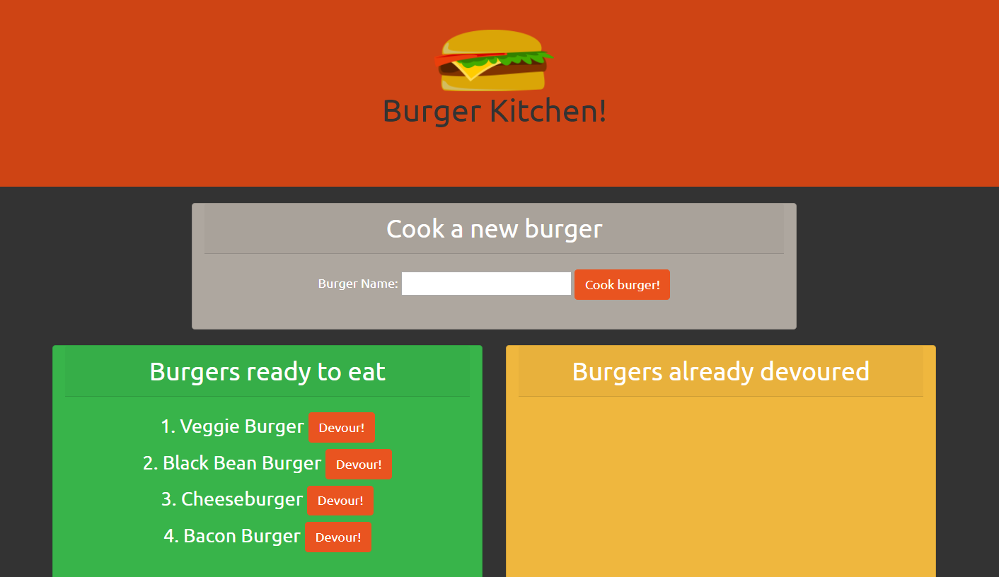
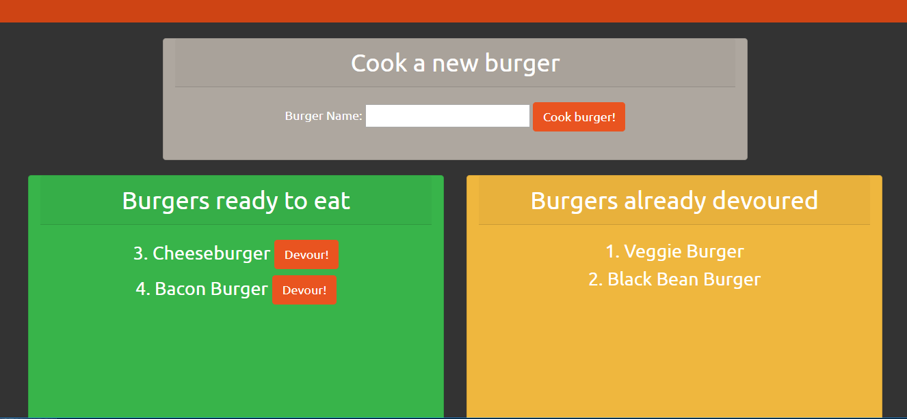
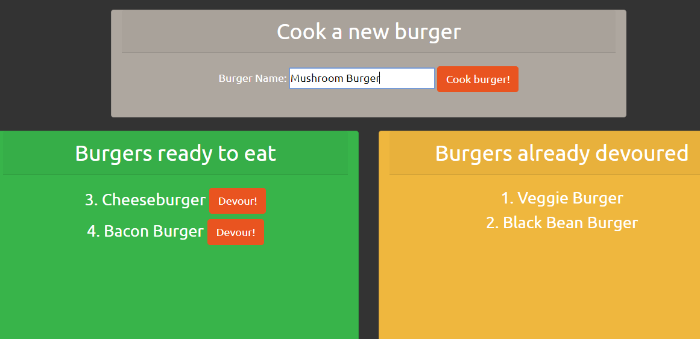
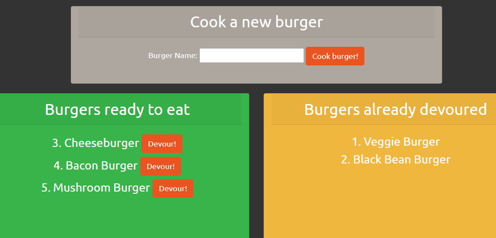

# Burger Kitchen

## This app allows users to cook and devour burgers. It is built using Express, stores and retrieves data with SQL, and renders burger information with Handlebars.

### The app displays a form for creating new burgers, and two panels for burgers that have been cooked and burgers that have been eaten.

### When the "devour" button is clicked, a put request is sent to update the burger's information and display it in the other panel.

### When the button is clicked to create a new burger, a post request is sent to create a new burger, and it is displayed in the left panel.

